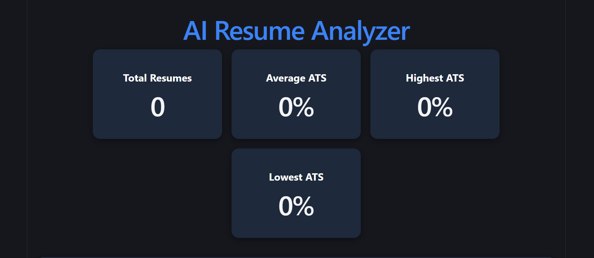
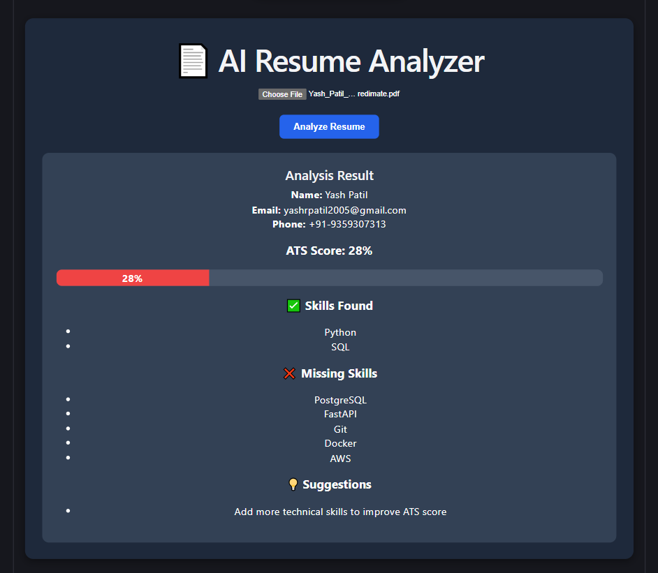
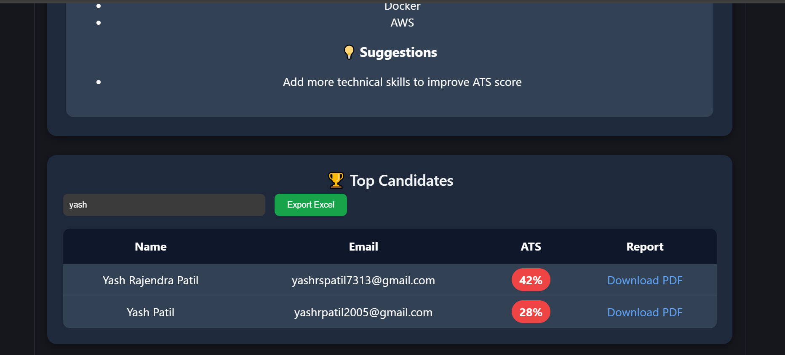

# AI_Resume_Analyzer
AI Resume Analyzer is a full-stack web application built with React, FastAPI, PostgreSQL, and SQLAlchemy. It analyzes PDF resumes, calculates ATS scores, identifies skills and missing keywords, generates PDF reports, provides candidate rankings, dashboard analytics, and Excel export functionality.
# 🚀 AI Resume Analyzer

An AI-powered Resume Analyzer built using React, FastAPI, PostgreSQL, SQLAlchemy, and Python.

The application analyzes PDF resumes, extracts candidate information, calculates ATS scores, identifies missing skills, ranks candidates, generates PDF reports, and provides dashboard analytics.

---

## 📌 Features

### 📄 Resume Analysis
- Upload PDF resumes
- Extract candidate Name, Email, and Phone Number
- Skill detection
- Missing skill detection
- ATS Score calculation
- Personalized improvement suggestions

### 📊 Dashboard Analytics
- Total Resumes
- Average ATS Score
- Highest ATS Score
- Lowest ATS Score

### 🏆 Candidate Ranking
- Top candidate leaderboard
- Search candidate by name
- ATS score badges
- Candidate ranking system

### 📑 Report Generation
- Download PDF reports
- Export candidate data to Excel

### 🗄 Database Integration
- PostgreSQL database
- SQLAlchemy ORM
- Resume storage and retrieval

---

# 🛠 Tech Stack

## Frontend
- React.js
- Axios
- CSS

## Backend
- FastAPI
- Python

## Database
- PostgreSQL
- SQLAlchemy

## Libraries
- pdfplumber
- ReportLab
- Pandas
- OpenPyXL

---

# 📷 Screenshots

## Dashboard



---

## Resume Analysis



---

## Top Candidates



---

# ⚙️ Installation

## Clone Repository

```bash
git clone https://github.com/yashpatil7313/AI_Resume_Analyzer.git

cd AI_Resume_Analyzer
```

---

## Backend Setup

```bash
cd backend

python -m venv venv

venv\Scripts\activate

pip install -r requirements.txt
```

---

## PostgreSQL Database

Create Database:

```sql
CREATE DATABASE ai_resume_detector;
```

Create Table:

```sql
CREATE TABLE resume_analysis (
    id SERIAL PRIMARY KEY,
    name VARCHAR(100),
    email VARCHAR(100),
    phone VARCHAR(20),
    ats_score INTEGER,
    skills VARCHAR(500)
);
```

---

## Run Backend

```bash
uvicorn main:app --reload
```

Backend URL:

```text
http://127.0.0.1:8000
```

---

## Frontend Setup

```bash
cd frontend

npm install

npm run dev
```

Frontend URL:

```text
http://localhost:5173
```

---

# 📂 Project Structure

```text
AI_Resume_Analyzer
│
├── backend
│   ├── main.py
│   ├── database.py
│   ├── models.py
│
├── frontend
│   ├── src
│   │   ├── components
│   │   │   ├── ResumeUpload.jsx
│   │   │   ├── Dashboard.jsx
│   │   │   └── TopCandidates.jsx
│   │   │
│   │   ├── App.jsx
│   │
│   └── package.json
│
└── README.md
```

---

# 🔥 ATS Scoring Logic

The ATS score is calculated based on matching required skills.

Required Skills:

- Python
- SQL
- PostgreSQL
- FastAPI
- Git
- Docker
- AWS

Formula:

```text
ATS Score =
(Matched Skills / Total Skills) × 100
```

---

# 🎯 Future Improvements

- AI-based resume recommendations
- Resume keyword optimization
- Job description matching
- Authentication system
- User accounts
- Cloud deployment
- Email notifications
- Interview prediction model

---

# 👨‍💻 Author

**Yash Patil**

B.Tech Computer Science & Design

MIT College of Engineering

GitHub:

https://github.com/yashpatil7313

---

# ⭐ If you like this project

Give it a Star ⭐ on GitHub.
